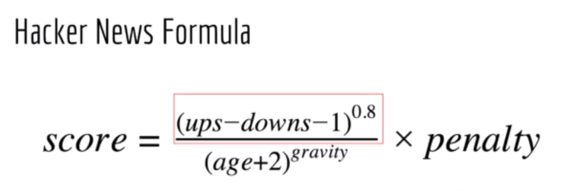
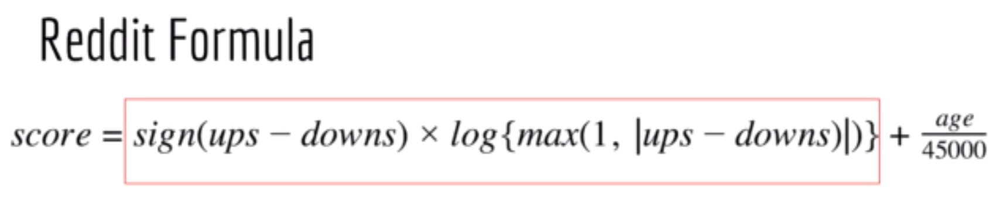
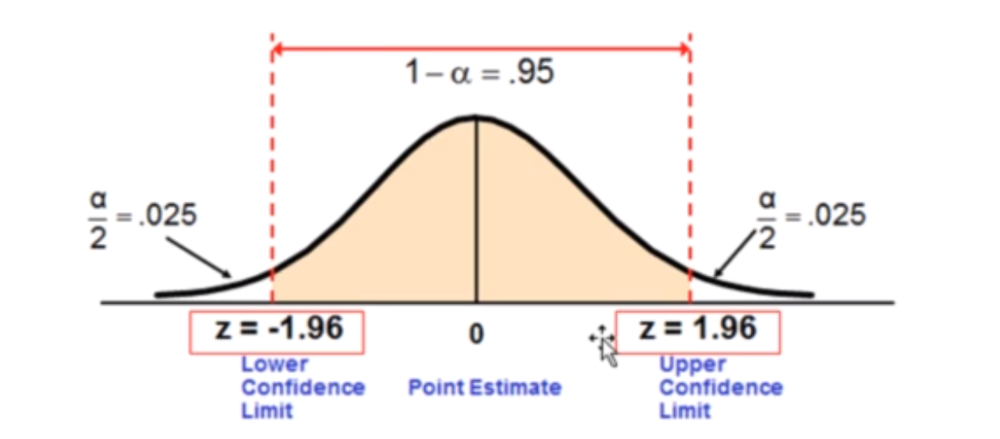
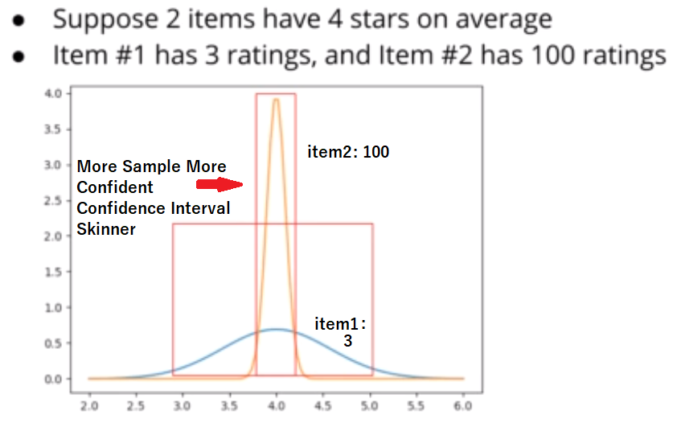
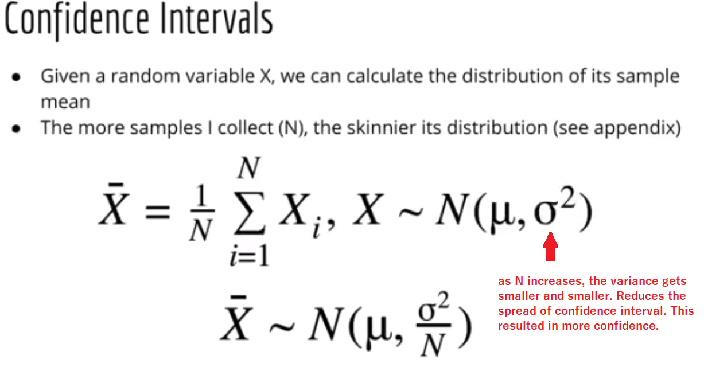
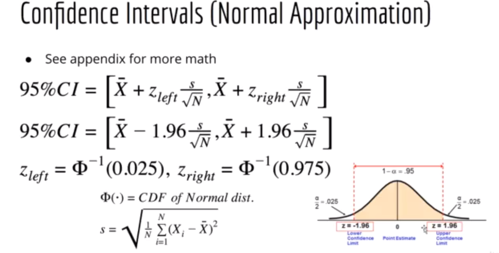
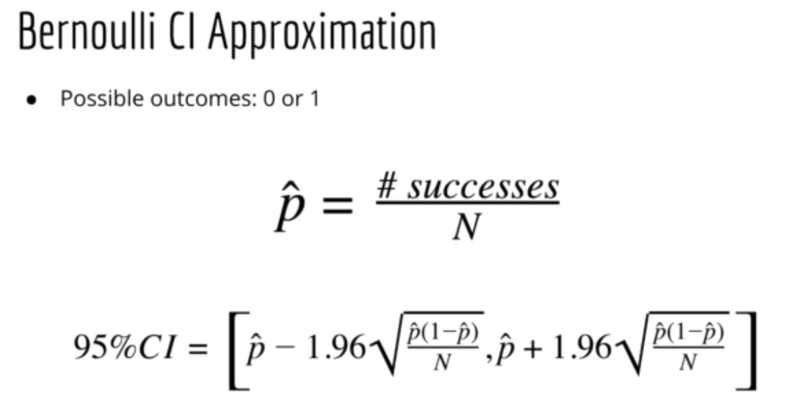
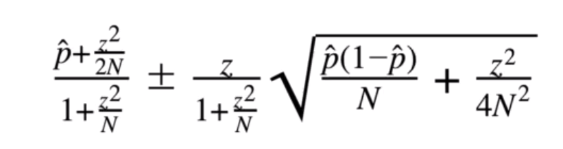

# 😲 Recommender System
A recommender system is like a helpful friend that suggests things you might like, based on your preferences. It's designed to recommend products, movies, or content to users, making their choices more personalized and enjoyable. 😊

# 🔥 Non-Personalized Recommender System
A non-personalized recommender system suggests the same items to all users, without considering individual preferences. An example is the "Trending" section on a streaming platform, recommending popular content to all users based on overall popularity rather than personal tastes. 📺

### 😁 Types:

Collaborative Filtering: What you liked before and what other similar to you have liked.

Imagine it's like connecting with others who share your interests, and the system suggests things loved by your like-minded buddies. 🎬

Content-Based Filtering: Think of it as a virtual taste bud explorer—it recommends things by focusing on the unique flavors you enjoy, like suggesting songs that match your favorite musical vibes. 🎶

# 😵 Matrix Factorization a.k.a SVD

Matrix Factorization is used in recommender systems to break down a large user-item interaction matrix into smaller matrices, helping identify latent factors and patterns that enhance the system's ability to make personalized and accurate recommendations. 

# 👋 Deep Learning
-- Keras
-- Matrix Factorization in Keras
-- Deep Neural Network
-- Residual Network
-- Unsupervised Deep learning
    a. Autoencoder
    b. Unsupervised Boltzman Machines

# 😺 Dataset : 

📊 About Dataset:
The datasets illustrate ratings and free-text tagging activities from MovieLens, a movie recommendation service. With 20000263 ratings and 465564 tag applications spanning 27278 movies, the data, generated on October 17, 2016, captures insights from 138493 users who participated between January 09, 1995, and March 31, 2015. Users were randomly selected, ensuring inclusion of those who had rated at least 20 movies. 🎬📅

url: https://www.kaggle.com/datasets/grouplens/movielens-20m-dataset

# 👀 Basic Intution 

👉 1. Pouplarity: "Most of them like yo like as well

👉 2. Associated Product: Probability of purchase Product A individually 10% whereas if someone purchases Product B will purchase Product A, probability will be 20% in that case. 

# Different Website and their Algorithm
### 📢 HackerNews: 
Balancing Popularity with Age 

📌 note: 
ups/downs: upvotes / downvotes
gravity: put more weights on rank of old news/post. Reduce the ranking score of it.
penalty : for popular side, controversial links/urls, no reason at all based on the owner/developer.
It can be possible for HackerNews to fairly or unfarily push down or push up the news using penalty.

📌 How Hacker News ranking really works: scoring, controversy, and penalties:
ref: https://www.righto.com/2013/11/how-hacker-news-ranking-really-works.html

### 📢 Reddit: 

1. It has sublinearity like as HankerNews. Initial growth of vote count is faster and gets slower over time.
2. If net votes is positve(more upvotes), log result is poitive.
3. If net votes is negative(more downvotes), log result is negative.
4. 45000 is a chosen number of reddit developers and it reduces the impact of overwhelmingness of new post.
   
   **`--Big site like Reddit/Facebook/Google has a responsibility to remain neutral.--`**

👉 3. Rating:
   
   --5 Star Rating: Amazon, Best Buy, Walmart
   
   --Thumbs up / down Rating: Netflix

Problem of Average Rating: 

-- 5 star --> rated by user count 1

-- 4 star --> rated by user count 540

note: failed miserably. and the key point of this problem is **`Confidence`**

### Confidence 

📌 As the sample size (N) increases, the standard error decreases, leading to a smaller spread in the confidence interval. A smaller spread indicates greater precision and more confidence in the estimate. In statistical terms, larger sample sizes tend to result in more reliable and accurate estimates of population parameters, reducing the variability and increasing the level of confidence in the results.
### 👾 Normal Distribution

**📌 note:** sample may not be normally distributed. But sum of random variable convergence to normal distribution.

### 👾 Bernouli Distribution
Use for binary outcome

**📌 note:**  p-hat (total upvote / total votes)

### 👾 Wilson Interval (Better for Bernouli Distribution then Bernoulli)
The Wilson interval provides more accurate estimates for binary outcomes because it adjusts for continuity correction (account for the continuity between discrete points), offering better coverage probabilities, especially when the probability of success is close to 0 or 1.

Absolutely! Here's the complete comedy competition:

- **Confidence Interval for Normal Distribution:**
  - Imagine you're also guessing the average number of laughs per comedian. You use a confidence interval, saying, "I'm 95% confident the average laughs for both Bernie and Wacky Wilson is between 50 and 100 per performance."

- **Bernoulli Interval (Bernie):**
  - Bernie's jokes are like flipping a fair coin. You estimate the laughter interval for each joke, saying, "I'm 95% sure between 30% and 70% of the audience will laugh."

- **Wilson Interval (Wacky Wilson):**
  - Now, Wacky Wilson's jokes are a bit wild. You use the Wilson interval to predict how many people will laugh or raise an eyebrow, saying, "I'm 95% confident between 20% and 80% will react to Wilson's unpredictable humor."

So, not only are you predicting laughter intervals for the jokes, but you're also confidently estimating the average laughs for the entire comedy competition!

- **😊 5 Star Rating(5 Possible Outcome)**
   - Bernoulli Interval doesn't work
   -  Wilson Interval Still Works

🌟 note: Hacker News uses same sorting algorithm for both url and comments. Whereas Reddit uses wilson interval for sorting comments.

Key notes: Lower Boundary is pessimistic (negative perciption)
example, one 3 star rating on good product can be penalized. 

# 😵 More Problem with Average Rating
  👉 1. Smoothing (Damping): use in NLP and Page Rank
   
  In the context of **NLP and average rating**, smoothing or damping often refers to techniques used to handle cases where there are limited data points or extreme ratings.

**🔥key note:** use of Bayesian smoothing or Laplace smoothing to adjust the **sentiment score**.

  In the context of average ratings, imagine a product receiving two ratings: one very positive (5 stars) and one very negative (1 star). Without damping, the average rating would be (5 + 1) / 2 = 3, which might not accurately represent the overall satisfaction. **`Smoothing(Damping Methods)`** could be applied to mitigate the impact of extreme ratings, providing a more balanced and reliable average.

# 😈 Explore-Exploide Dilema :

- Exploration-Exploitation Dilemma: Analyzing 10 slot machines in a casino to identify the best performer.

- Data Gathering: Playing 100 games on each machine (totaling 1000 games) for a more accurate estimate.

- Dilemma Introduction: Increasing the number of games enhances precision but introduces the explore-exploit dilemma.

- Game Distribution: Dividing the 1000 games into 900 suboptimal outcomes and 100 optimal outcomes.

- Base Machine Identification: Recognizing one machine as the baseline for comparison.

- Dilemma Cause: Acknowledging that the presence of suboptimal outcomes triggers the explore-exploit dilemma.

### 🎥 Youtube Video:
**🔔 Explore-Exploit Dilemma**
Suppose I've watched YouTube videos on how to cook eggs and learned the technique. Despite this, YouTube continues to suggest these egg-related videos due to the explore-exploit dilemma. Even when I'm exploring other topics like machine learning, the explore-exploit dilemma still leads to recommendations for egg videos, even though I no longer need them.

Strategic Adjustment: Adapting the strategy to balance exploration and exploitation based on gathered data.

